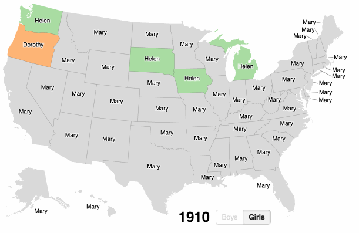

# Popular Baby Names by State 1910-2015 #

[](https://msbarry.github.io/babymap/)

Built using [D3](https://d3js.org/), [webpack](https://webpack.github.io/),
[topojson](https://github.com/topojson/topojson), and [nodejs](https://nodejs.org/).

Name data is from the U.S. Social Security Administration's
["Popular Baby Names" dataset](https://www.ssa.gov/oact/babynames/limits.html).
State outlines are from [Natural Earth](http://www.naturalearthdata.com/).

## Setup ##

* [Install yarn](https://yarnpkg.com/en/docs/install)
* Install dependencies: `yarn install`
* Install [gdal](http://www.gdal.org/): `brew install gdal`

To run: `npm start`

To build: `npm run build`

To regenerate map: `npm run gen`

Creator: [Mike Barry](https://twitter.com/msb5014)

## Embedding on a Website ##

To embed on a website, copy and paste this code:

```
<iframe width="600" height="530" frameborder="0" scrolling="no" marginheight="0" marginwidth="0" src="https://msbarry.github.io/babymap/"></iframe><br/><small style="color:#0000FF;text-align:left"><a href="https://msbarry.github.io/babymap/" target="_blank">msbarry.github.io</a></small>
```
